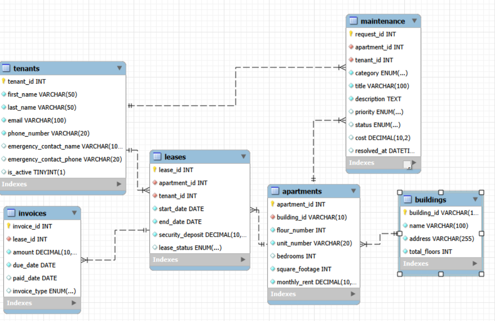

# Rental Community – Data Analysis & AI Specialist Challenge

## Overview
This assessment evaluates your ability to set up a database environment, write advanced SQL analytical queries, and design executive-ready Power BI dashboards.

---

## Part 1: Database Setup
1. Create a MySQL database named `rental_community`.
2. Update your local `config.json` file with your MySQL connection credentials (host, user, password, database).
3. Execute `main_create_tables.py` to generate the schema.
4. Execute `main_upload_data.py` to populate the dataset.
---

## Part2: ERD Diagram - validate your data base structure

## Part 3: SQL Data Analysis
Write optimized SQL queries to answer the following business questions:

1. **Payment Reliability:** Identify active leases that have accumulated overdue rent or penalty charges.
2. **Operational Profitability:** Measure total annual rental income collected versus total resolved maintenance costs for each building.
3. **Maintenance SLAs:** Rank maintenance categories by resolution delay and identify "troubled" units with frequent long-duration repairs (>48 hours).
4. **Lease Continuity:** Analyze occupancy continuity and calculate the turnover gap (idle days) between consecutive leases per apartment.
5. **High-Risk Tenants:** Identify tenants who are simultaneously late on payments (unpaid balance > 1.5x monthly rent) **AND** generating high maintenance costs (> 50% of security deposit across >3 requests).

---

## Part 4: Power BI Dashboards
Develop a interactive, multi-page Power BI report (`.pbix`) containing the following dashboards:

### Page 1: Executive Financial & Revenue Dashboard
* **Audience:** Property Owners, Executives, Financial Controllers
* **KPI Cards:**
  1. Total Revenue Collected vs. Potential Revenue
  2. Total Outstanding Balance (Unpaid Invoices)
  3. Average Rent Collected per Sq. Ft.
  4. Total Security Deposits Held
* **Visualizations:**
  1. **Revenue Stream Breakdown:** Stacked Bar Chart comparing revenue by type (`Rent`, `Utilities`, `Maintenance Fee`, `Penalty`).
  2. **Monthly Collection Trends:** Line Chart plotting total billed vs. total collected revenue over time.
  3. **Building Revenue Ranking:** Horizontal Bar Chart ranking buildings by net revenue generated.

### Page 2: Tenant Accounts Receivable & Collections Dashboard
* **Audience:** Property Managers & Accounts Receivable Teams
* **KPI Cards:**
  1. Total Delinquent Amount
  2. Overall Collection Rate (%)
  3. Total Overdue Invoices Count
  4. Total Penalties/Late Fees Assessed
* **Visualizations:**
  1. **AR Aging Matrix:** Matrix visual bucketing unpaid balances (`Current`, `1–30 Days Late`, `31–60 Days Late`, `60+ Days Late`).
  2. **Top Delinquent Tenants:** Detailed Table displaying tenants with the highest unpaid balances, contact details, and lease status.
  3. **Payment Delay Distribution:** Histogram showing average payment resolution time (days taken to pay after `due_date`).

---

## Submission Deliverables
Please package and submit a single zip file containing:
1. **`solution.sql`**: All SQL queries written for Part 2 (clearly commented by question number).
2. **`Rental_Community_Analytics.pbix`**: The completed Power BI report file for Part 3.
